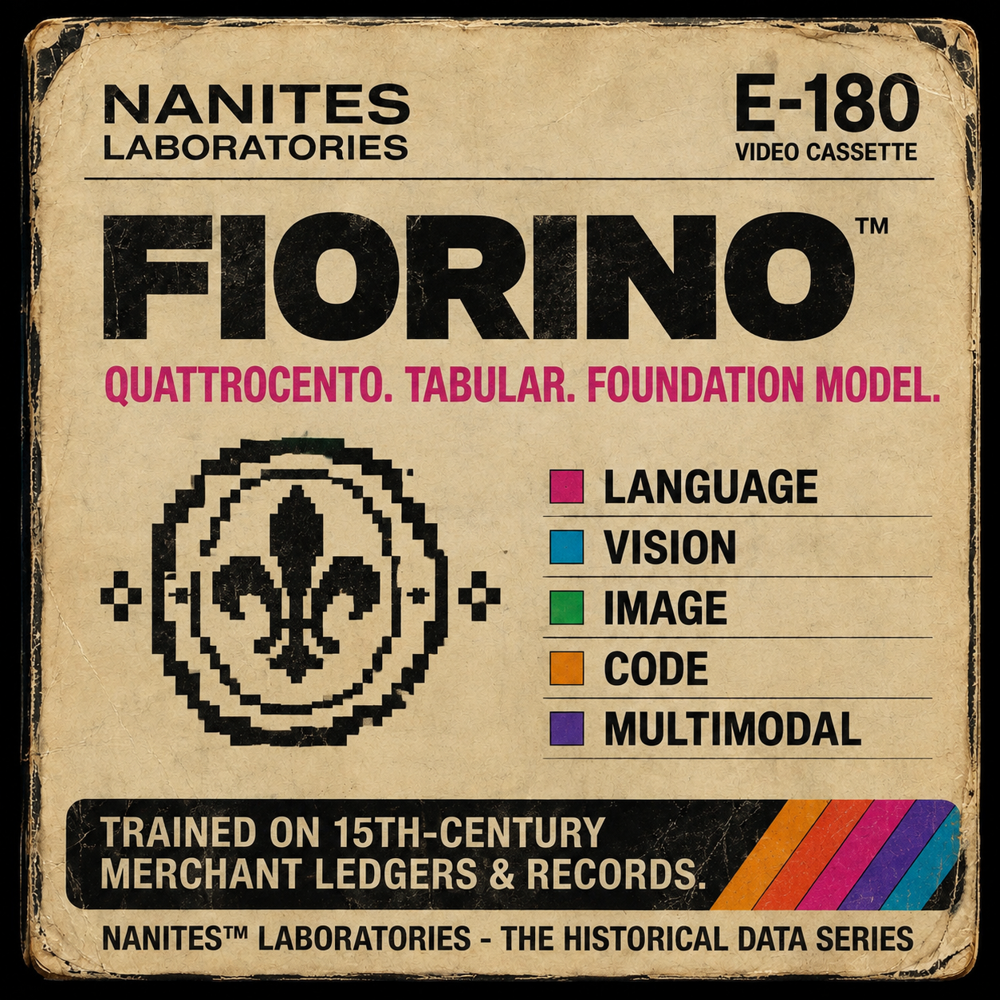

# fiorino



**226,000 tables in the record run (≈400,000 across the lineage) vs
100,000,000+ at the big labs — a nano-lab build.**

R interface to [Fiorino](https://github.com/frankiethull/fiorino) —
nano quattrocento tabular fondamento model with synthetic and real-data priors.
Same idea as TabICL / TabPFN wrappers: `fio_fit()` stores the in-context prompt
(no gradients), `fio_predict()` answers queries in one forward pass.

Inference runs through the Python `fiorino` package over
[reticulate](https://rstudio.github.io/reticulate/) — one arch source of
truth, no port drift.

Weights: `Nanite-Labs/nanites-fiorino-tabular`
(`fiorino-classification-bifronte` / `fiorino-regression-bifronte` release).

## Installation

```r
# install.packages("devtools")
devtools::install_github("frankiethull/fiorino", subdir = "r/fiorino")

library(fiorino)
install_fiorino()  # installs the Python backend once
```

## Usage

```r
library(fiorino)

clf <- fiorino_classifier()  # repo_id="Nanite-Labs/nanites-fiorino-tabular"
clf <- fio_fit(clf, X_train, y_train)  # downloads fiorino-classification-bifronte once
fio_predict_proba(clf, X_test)

reg <- fiorino_regressor()   # downloads fiorino-regression-bifronte once
reg <- fio_fit(reg, X_train, y_train)
fio_predict(reg, X_test)
```

## Bifronte scope (multihead)

Bifronte ships both heads from one shared trunk: `fiorino-classification-bifronte`
(classifier) and `fiorino-regression-bifronte` (bucket readout). The
regressor trails RandomForest on heavy tails — tracked openly in the
paper; the bar is beating RF on TabArena-13.

## Notes & limits (v0.1)

- Backend: `python/src/fiorino/_arch.py` is a snapshot of the
  monorepo `experts/fiorino/model.py` (re-synced on release); this package
  calls it via reticulate, it does not reimplement it.
- Context caps: 2048 rows (subsampled), ~44 features.
- Preprocessing mirrors training (train-only encodings/stats).
- Tests: `devtools::test()` (live-inference tests skip without the Python
  backend; weights download on first fit).
